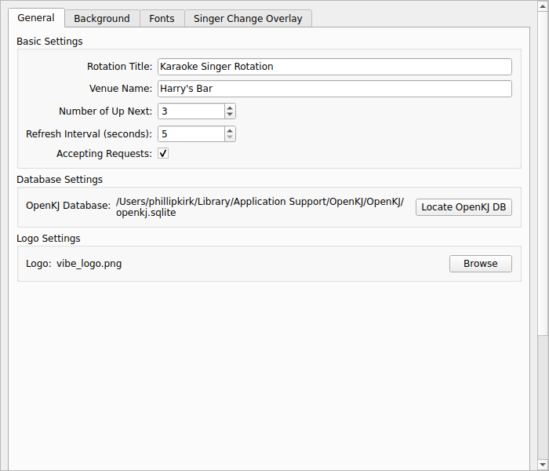
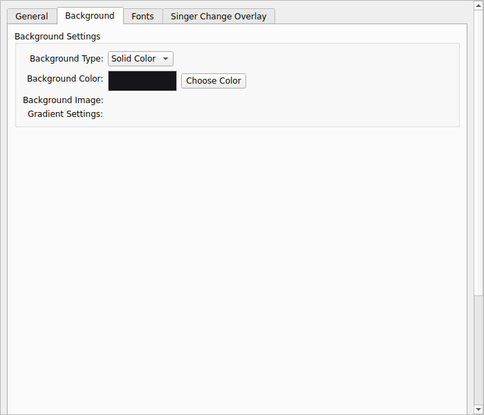
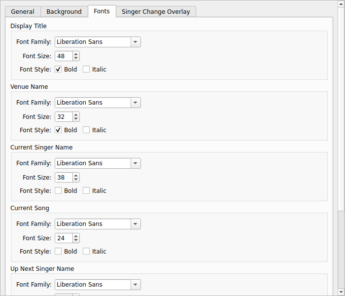
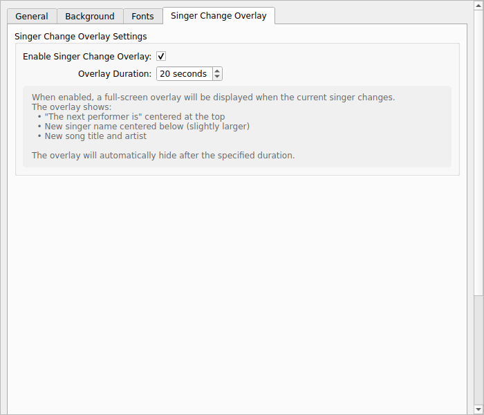
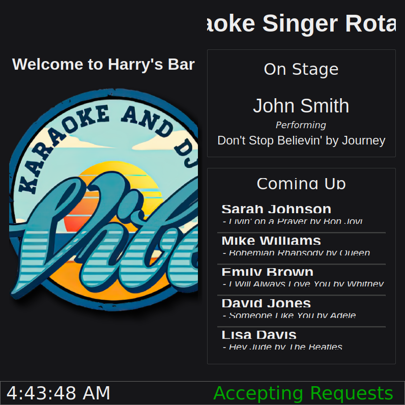
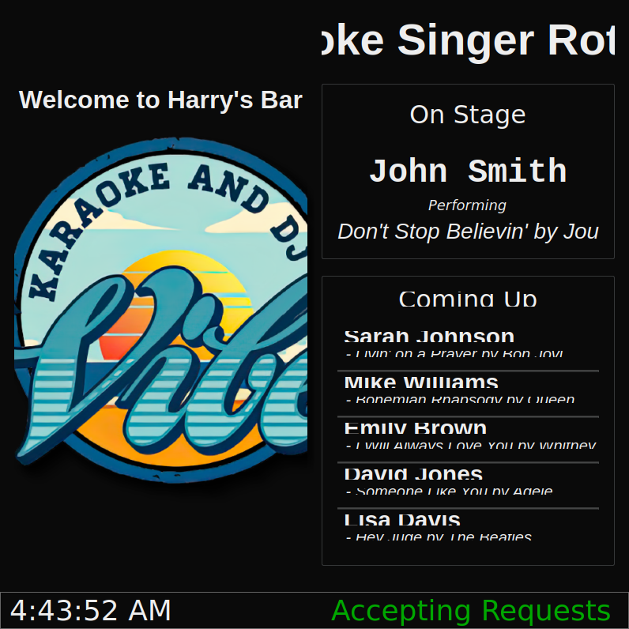

# OpenKJ Next Singer Display

A professional karaoke singer rotation display application for venues running OpenKJ.

## Features

### Core Display
- Real-time display of current performer and song
- Configurable "Up Next" list showing upcoming performers
- Venue name and custom title display
- Logo support
- Live clock display
- Accepting/Not Accepting Requests indicator

### Advanced Customization

#### Enhanced Settings Dialog
Professional 4-tab configuration interface:
- **General Settings**: Basic configuration options
- **Background Settings**: Full background customization
- **Font Settings**: Individual font control for all text elements
- **Singer Change Overlay**: Notification configuration

#### Background Customization
- **Solid Color**: Choose any color with color picker
- **Image**: Use a custom background image
- **Gradient**: Create smooth color transitions
  - Vertical, horizontal, or diagonal gradients
  - Custom start and end colors

#### Font Customization
Individual font settings for each display element:
- Display Title
- Venue Name
- Current Singer Name
- Current Song
- Up Next Singer Names
- Up Next Songs

Each element supports:
- Font family selection (all system fonts)
- Font size (8-144px)
- Bold styling
- Italic styling

#### Singer Change Overlay
Automatic full-screen notification when the current singer changes:
- Prominently displays "The next performer is"
- Shows new singer name and song
- Configurable display duration (5-60 seconds)
- Can be enabled/disabled

### Additional Features
- Automatic database detection (macOS/Windows)
- Configurable refresh interval
- Fullscreen mode support
- Context menu for quick access
- Reset to default settings option
- Configuration persistence

## Requirements

- Python 3.8+
- PyQt6
- SQLite3
- OpenKJ karaoke management software

## Installation

1. Clone this repository
2. Install dependencies:
   ```bash
   pip install PyQt6
   ```
3. Run the application:
   ```bash
   python main.py
   ```

## Configuration

On first run, you'll be prompted to locate your OpenKJ database. The application will attempt to auto-detect it based on your operating system:
- **macOS**: `~/Library/Application Support/OpenKJ/OpenKJ/openkj.sqlite`
- **Windows**: `%APPDATA%\OpenKJ\OpenKJ\openkj.sqlite`

If auto-detection fails, you can manually browse to select the database file.

## Usage

### Opening Settings
Right-click anywhere on the display and select "Show Config" to open the settings dialog.

### Customizing Your Display
1. **General Tab**: Configure basic settings like title, venue name, and database location
2. **Background Tab**: Choose your background type (color, image, or gradient)
3. **Fonts Tab**: Customize fonts for each text element on the display
4. **Overlay Tab**: Configure the singer change notification overlay

### Resetting Settings
Click "Reset to Default" in the settings dialog to restore all settings to their original values (except database path).

## Documentation

- **[USER_GUIDE.md](USER_GUIDE.md)**: Comprehensive end-user documentation
- **[IMPLEMENTATION_SUMMARY.md](IMPLEMENTATION_SUMMARY.md)**: Technical implementation details
- **[screenshots/](screenshots/)**: Visual documentation with examples

## Screenshots

### Configuration Tabs
<table>
  <tr>
    <td><br><em>General Settings</em></td>
    <td><br><em>Background Settings</em></td>
    <td><br><em>Font Settings</em></td>
    <td><br><em>Overlay Settings</em></td>
  </tr>
</table>

### Display Examples
<table>
  <tr>
    <td><br><em>Default Display</em></td>
    <td><br><em>Gradient Background</em></td>
  </tr>
  <tr>
    <td><br><em>Custom Fonts</em></td>
    <td><br><em>Singer Change Overlay</em></td>
  </tr>
</table>

See [screenshots/README.md](screenshots/README.md) for detailed descriptions.

## Default Settings

- **Background**: Dark gray (#161619)
- **Display Title**: Arial 48px Bold
- **Venue Name**: Arial 32px Bold
- **Current Singer**: Arial 38px
- **Current Song**: Arial 24px
- **Up Next Singers**: Arial 30px Bold
- **Up Next Songs**: Arial 20px Italic
- **Overlay Duration**: 20 seconds
- **Refresh Interval**: 5 seconds
- **Number of Up Next**: 5 singers

## Configuration File

Settings are stored in `config.json.bak` in the application directory. The configuration is automatically saved when you click "Save Configuration" in the settings dialog.

## Keyboard Shortcuts & Controls

- **Right-click**: Open context menu
- **Context Menu Options**:
  - Make Fullscreen / Make Windowed
  - Show Config
  - Close

## Troubleshooting

### Settings not saving
- Check file permissions on `config.json.bak`
- Ensure the application has write access to its directory

### Fonts not displaying correctly
- Verify the selected font is installed on your system
- Try a common font like Arial or Times New Roman
- Restart the application after changing fonts

### Background image not showing
- Check the image file exists at the specified path
- Supported formats: PNG, JPG, JPEG, BMP, GIF
- Try a different image file

### Overlay not appearing
- Ensure "Enable Singer Change Overlay" is checked in settings
- Verify singers are actually changing in the rotation
- Check that the database is being updated by OpenKJ

## Contributing

Contributions are welcome! Please feel free to submit pull requests or open issues for bugs and feature requests.

## License

This project is open source. Please check with the repository owner for specific license terms.

## Credits

Designed to work seamlessly with [OpenKJ](https://openkj.org/) karaoke management software.

## Support

For detailed usage instructions, see the [USER_GUIDE.md](USER_GUIDE.md) file.

For technical details about the implementation, see [IMPLEMENTATION_SUMMARY.md](IMPLEMENTATION_SUMMARY.md).
