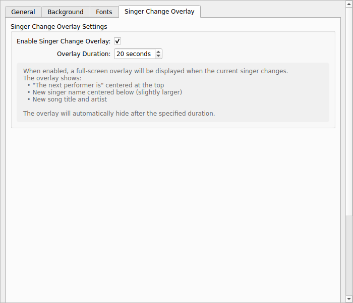
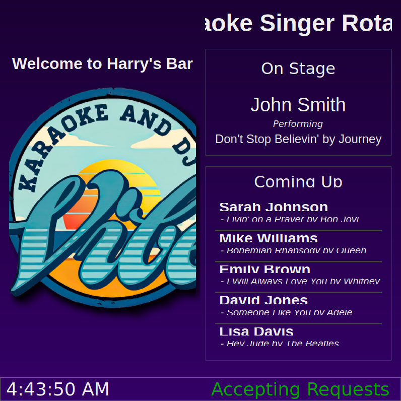
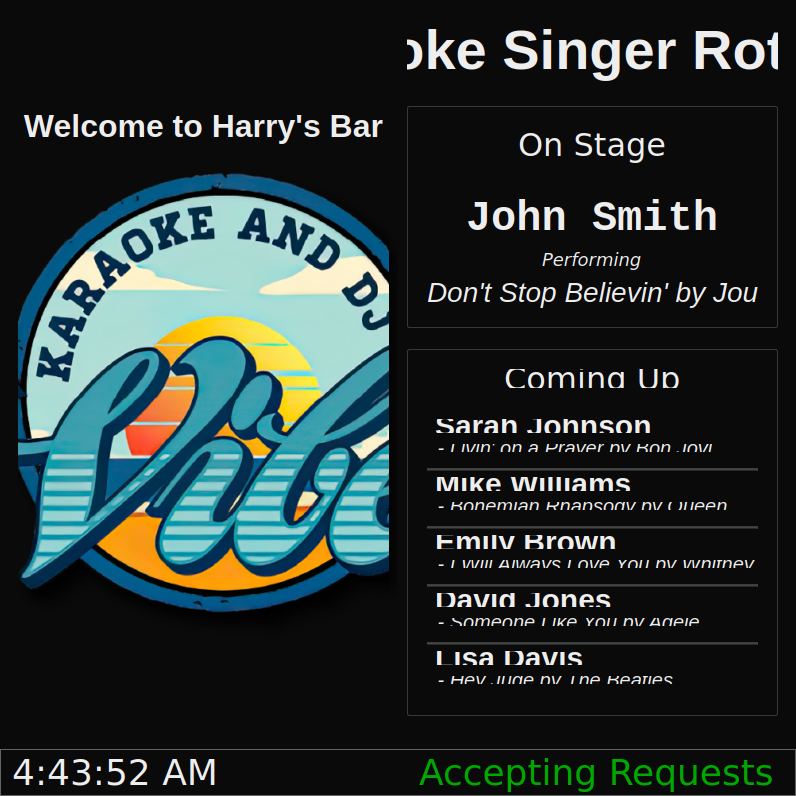

# Screenshots

This directory contains screenshots demonstrating the enhanced settings dialog and display features.

## Configuration Dialog Tabs

### Tab 1: General Settings

Contains basic configuration options:
- Rotation Title
- Venue Name
- Number of Up Next singers
- Refresh Interval
- Accepting Requests toggle
- Database file location
- Logo selection

### Tab 2: Background Settings

Allows customization of the display background:
- Background Type: Solid Color, Image, or Gradient
- Color picker for solid backgrounds
- Image file selection
- Gradient color selection (start and end)
- Gradient direction (Vertical, Horizontal, Diagonal)

### Tab 3: Font Settings

Comprehensive font customization for all display elements:
- Display Title
- Venue Name
- Current Singer Name
- Current Song
- Up Next Singer Names
- Up Next Songs

Each font can be customized with:
- Font Family
- Font Size
- Bold/Italic styling

### Tab 4: Singer Change Overlay

Controls the new singer change notification overlay:
- Enable/disable the overlay
- Set overlay duration (5-60 seconds)
- Displays explanation of the feature

## Display Window Examples

### Default Solid Color Background

The default configuration with a solid dark background.

### Gradient Background

Display with a vertical gradient from dark purple to lighter purple.

### Custom Fonts

Display with customized fonts showing different font families and sizes.

### Singer Change Overlay

The overlay that appears when the current singer changes, showing:
- "The next performer is" heading
- New singer name (larger, centered)
- Song title and artist

The overlay automatically disappears after the configured duration (default 20 seconds).

## Features Implemented

1. **Organized Settings Dialog**
   - Clean tabbed interface
   - Grouped settings by category
   - Professional appearance
   - Reset to Default button

2. **Background Customization**
   - Solid colors with color picker
   - Background images
   - Gradient backgrounds (vertical, horizontal, diagonal)

3. **Font Customization**
   - Individual font settings for each display element
   - Font family selection
   - Font size control
   - Bold and italic styling

4. **Singer Change Overlay**
   - Automatic detection of singer changes
   - Full-screen overlay notification
   - Configurable display duration
   - Professional presentation of new performer information

All settings are saved to configuration and persist across application restarts.
